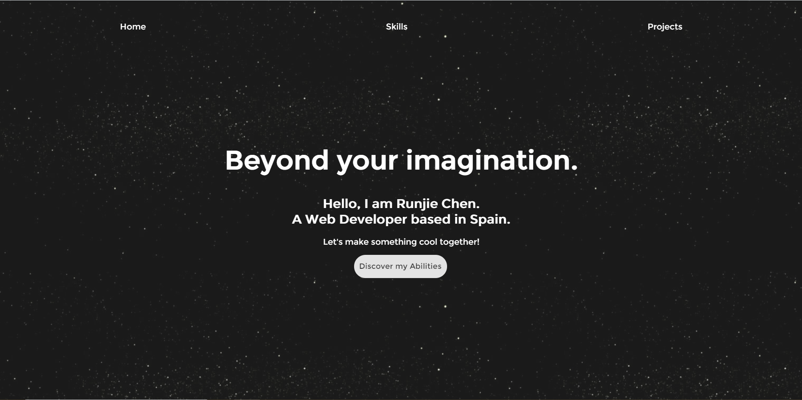

# My personal portfolio
> Live demo [_here_](https://runjiechenportfolio.herokuapp.com/). <!-- If you have the project hosted somewhere, include the link here. -->

## Table of Contents
* [Technologies Used](#technologies-used)
* [Screenshots](#screenshots)
* [Project Status](#project-status)
* [Contact](#contact)
<!-- * [License](#license) -->

## Technologies Used
- React
- Javascript
- CSS 

## Screenshots

<!-- If you have screenshots you'd like to share, include them here. -->

## Project Status
Project is: complete

## Contact
Created by [@arstix](https://runjiechenportfolio.herokuapp.com/) - feel free to contact me!

<!-- Optional -->
<!-- ## License -->
<!-- This project is open source and available under the [... License](). -->

<!-- You don't have to include all sections - just the one's relevant to your project -->
